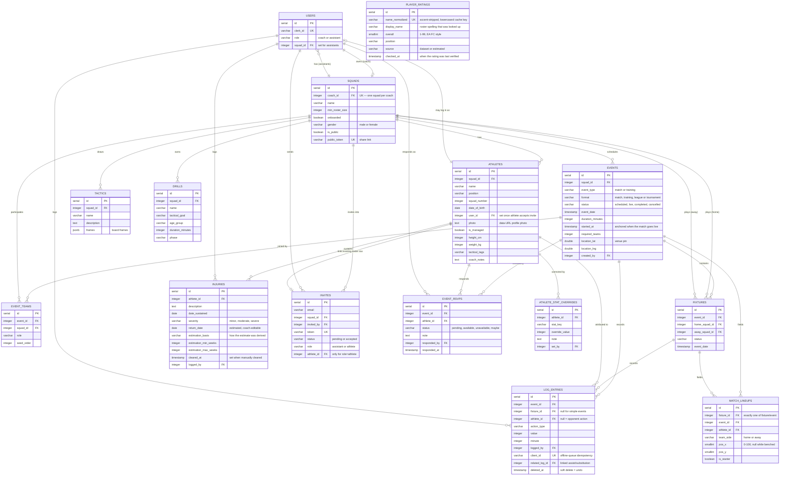

# Data Model

:::caution Keep this in sync
This reflects the schema as of the migrations in `backend/migrations/` at
the time of writing. Migrations are the source of truth — if this page and
the migrations folder disagree, trust the migrations, and please update this
page (or flag it for someone to).
:::

## Entity-relationship diagram



Details worth calling out since they're easy to misread from the diagram
alone:

- **`SQUADS ||--o{ FIXTURES`** appears twice (home and away) — a fixture
  always references two different squads, both via the same
  `squads.id` foreign key pattern, just in two separate columns
  (`home_squad_id`, `away_squad_id`).
- **`ATHLETES ||--o| INVITES`** is optional and only set when
  `invites.role = 'athlete'` — it links an invite to an *existing*
  roster row (so accepting it attaches login access to that athlete's
  existing stats history) rather than creating a disconnected account.
  Assistant invites don't use this field at all.
- **`PLAYER_RATINGS` has no relationship arrows at all** — it is a lookup
  cache keyed by a normalised player name, not by `athletes.id`, because one
  lookup serves every squad that ever fields that player and the row must
  outlive any single athlete record. See
  [the ratings dataset page](../third-party/player-ratings.md) for the caching
  and fallback rules.

---
## Design rationale

### Why a relational model?

The sport coaching domain is inherently relational:
- A **coach** owns exactly one **squad**, and a squad has many **athletes**.
- **Events** belong to a squad and contain **log entries** attributed to specific athletes.
- **Fixtures** connect two squads (home and away) within a **league event**.

PostgreSQL was chosen over alternatives (MongoDB, SQLite) because:
1. **Referential integrity** — foreign keys and cascade deletes ensure that removing a squad automatically cleans up its athletes, events, and log entries.
2. **Complex queries** — standings calculations (points, goal difference, goals for) require JOINs and aggregations that are natural in SQL but awkward in document stores.
3. **Concurrency** — multiple assistants logging simultaneously (advanced tier) requires transaction support.

### Key design decisions

| Decision | Motivation |
|----------|------------|
| `squads.coach_id` is unique | A coach owns exactly one squad. This prevents duplicate squads and simplifies ownership lookups. |
| `athletes.user_id` is nullable and optional | Athletes exist on the roster before they have an account. When they accept an invite, `user_id` is set to link them. |
| `log_entries.deleted_at` for soft deletes | "Undo" doesn't destroy data — it timestamps the row as deleted. This preserves audit history and allows recovery. |
| `invites.athlete_id` is nullable | Assistant invites don't link to a roster row. Only athlete invites do, so accepting the invite attaches login to the existing stats. |
| `events.status` is a string, not an enum | Allows adding new statuses (e.g., `postponed`) without a migration. |
| Statistics are computed on read | Avoiding a separate `stats` table means the log is the single source of truth. Stats can never drift out of sync. |
| `fixtures` are separate from `events` | A league event contains many fixtures. Keeping them in separate tables allows each fixture to have its own log, status, and date. |
| `injuries.return_date` is an estimate, not a verdict | The estimator derives a range from sports-medicine reference tables and stores the midpoint with its basis (`estimation_basis`). Coaches can override it (US30) — the stored value is always what the coach last confirmed. |
| `injuries.cleared_at` for early clearance | Recovery often beats the estimate. Setting `cleared_at` keeps the injury history for the athlete's record while dropping the active-injury flag. |
| `player_ratings` is keyed by a normalised name, not `athletes.id` | Ratings come from an external dataset keyed by player name, and one lookup serves every squad. Caching by name means the external API is only ever asked for a name it has not answered before, and renaming an athlete does not throw the rating away. |
| `event_rsvps` has one row per athlete per event | The unique `(event_id, athlete_id)` constraint makes an RSVP an upsert — re-responding updates the row instead of stacking duplicates, and the availability gate counts from this single source. |
| `athlete_stat_overrides` upserts per `(athlete_id, stat_key)` | A correction replaces the previous one for that stat, so the audit trail shows the *current* correction with its note rather than a stack of stale values. Derived stats stay untouched — overrides are merged over them on read. |
| `match_lineups` rows belong to exactly one of a fixture or an event | The `(fixture_id IS NOT NULL) != (event_id IS NOT NULL)` check lets one table serve both simple events (home side only) and fixtures (both sides). |
| `log_entries.client_id` has a partial unique index | Offline replay: a queued entry resent after a lost response hits the same `client_id` and returns the original row instead of duplicating it. Only non-null values are constrained, so legacy rows are unaffected. |
| `squads.public_token` + `is_public` power the public pages | The token is an unguessable share key for private links; `is_public` opts the squad into the public directory. Both are indexed/unique lookups with no auth context. |
| `squads.gender` is a hard CHECK (`male`/`female`) | Gender drives matchmaking filters; a database constraint (not just API validation) guarantees a squad always has a valid gender for the join-time filter. |

## Tables

### `users`

| Column | Type | Notes |
|---|---|---|
| `id` | serial, PK | |
| `clerk_id` | varchar(255), unique, not null | Links to the Clerk-hosted account |
| `role` | varchar(20), not null, default `'coach'` | `'coach'` or `'assistant'` |
| `squad_id` | integer | Set for assistants (see `fk_users_squad`); a coach's squad is instead found via `squads.coach_id` |
| `created_at` | timestamp | |

### `squads`

| Column | Type | Notes |
|---|---|---|
| `id` | serial, PK | |
| `coach_id` | integer, not null, references `users`, `ON DELETE CASCADE` | **Unique** — a coach owns exactly one squad |
| `name` | varchar | Defaults to `'My Squad'` on self-heal creation |
| `onboarded` | boolean, not null, default `false` | Set when the coach finishes first-login setup |
| `min_roster_size` | integer | Minimum available RSVPs required to start a match (defaults to 11) |
| `gender` | varchar(10), not null, default `'male'` | CHECK `'male'` or `'female'` — drives matchmaking filters |
| `is_public` | boolean, not null, default `false` | Opts the squad into the public landing directory |
| `public_token` | varchar(64), unique | Unguessable key for private share links |
| `created_at` | timestamp | |

### `athletes`

| Column | Type | Notes |
|---|---|---|
| `id` | serial, PK | |
| `squad_id` | integer, not null, references `squads`, `ON DELETE CASCADE` | |
| `name` | varchar(100), not null | |
| `position` | varchar(50) | |
| `squad_number` | integer | |
| `date_of_birth` | date | |
| `contact_info` | varchar(255) | |
| `email` | varchar(255) | Athlete invite address |
| `user_id` | integer, references `users` | Set once the athlete accepts their invite and can log in |
| `is_managed` | boolean, not null, default `false` | Managed (regular) vs rested status |
| `photo` | text | Client-downscaled data-URL profile photo (hosted disk is ephemeral) |
| `height_cm` / `weight_kg` | integer | Drive the BMI display on the profile and comparison pages |
| `tactical_tags` | varchar(255) | Free-text tactical labels (U39) |
| `coach_notes` | text | Free-text coach notes (U39) |
| `created_at` / `updated_at` | timestamp | |

### `events`

| Column | Type | Notes |
|---|---|---|
| `id` | serial, PK | |
| `squad_id` | integer, not null, references `squads`, `ON DELETE CASCADE` | |
| `title` | varchar(150) | Free-text title (calendar-form events) |
| `opponent` | varchar(100) | Set for matches |
| `event_type` | varchar(20), not null, default `'match'` | `'match'` or `'training'` |
| `format` | varchar(20), not null, default `'match'` | `'match'`, `'training'`, `'league'` or `'tournament'` — leagues/tournaments carry teams and fixtures |
| `event_date` | timestamp, not null | |
| `location` | varchar(255) | |
| `location_lat` / `location_lng` | double precision | Venue pin set by the map editor; takes precedence over geocoding the place name |
| `duration_minutes` | integer, not null, default `90` | Used by the auto-transition sweep |
| `started_at` | timestamp | Anchored the first time the event goes live so the timer and completion checks don't drift |
| `status` | varchar(20), not null, default `'scheduled'` | `'scheduled'` → `'live'` → `'completed'`, or `'cancelled'` |
| `required_teams` | integer | League/tournament only — fixtures generate once this many teams have joined |
| `created_by` | integer, not null, references `users` | |
| `created_at` / `updated_at` | timestamp | |

### `log_entries`

The core of live event tracking — one row per logged action.

| Column | Type | Notes |
|---|---|---|
| `id` | serial, PK | |
| `event_id` | integer, not null, references `events`, `ON DELETE CASCADE` | |
| `athlete_id` | integer, references `athletes`, `ON DELETE SET NULL` | `null` = action attributed to the opponent (e.g. their goal) |
| `action_type` | varchar(30), not null | e.g. `'goal'`, `'yellow_card'`, `'red_card'`, `'penalty'`, `'save'` |
| `is_scoring` | boolean, not null, default `false` | Whether this action contributes to the result |
| `value` | integer, not null, default `1` | Points/goals contributed if scoring |
| `minute` | integer | |
| `notes` | varchar(255) | |
| `logged_by` | integer, not null, references `users` | Who made the entry |
| `logged_at` | timestamp, not null, default `now()` | |
| `updated_at` | timestamp | |
| `deleted_at` | timestamp | **Soft delete** — set on "undo"; the row is kept for audit history but excluded from live views |
| `fixture_id` | integer, references `fixtures`, `ON DELETE CASCADE` | Set for fixture logs (mutually exclusive with a simple event row) |
| `related_log_id` | integer, references `log_entries` | Links derivative entries (assists, substitutions) to the primary log row |
| `client_id` | varchar(64), unique where not null | Client-generated id from the offline queue — replayed requests return the original row instead of duplicating |

### `injuries`

Roster availability tracking (US29–US31). One row per logged injury.

| Column | Type | Notes |
|---|---|---|
| `id` | serial, PK | |
| `athlete_id` | integer, not null, references `athletes`, `ON DELETE CASCADE` | |
| `description` | text, not null | Free text; keyword-matched against the estimator's injury reference table |
| `date_sustained` | date, not null | |
| `severity` | varchar(20), not null, default `'moderate'` | `'minor'`, `'moderate'`, or `'severe'` (CHECK constraint) |
| `return_date` | date | Estimated return-to-play date; coach-editable override (US30) |
| `estimation_basis` | varchar(255) | Human-readable note on how the estimate was derived (matched injury vs severity default) |
| `estimation_min_weeks` / `estimation_max_weeks` | integer | The reference range the midpoint was taken from |
| `cleared_at` | timestamp | Set when the coach manually clears the athlete early (US31) |
| `logged_by` | integer, not null, references `users` | Coach or assistant — matches live-logging access |
| `created_at` / `updated_at` | timestamp | |

### `invites`

| Column | Type | Notes |
|---|---|---|
| `id` | serial, PK | |
| `email` | varchar(255), not null | |
| `squad_id` | integer, not null, references `squads`, `ON DELETE CASCADE` | |
| `invited_by` | integer, not null, references `users` | |
| `token` | varchar(255), not null, unique | Used to build the invite link |
| `status` | varchar(20), not null, default `'pending'` | `'pending'` or `'accepted'` |
| `created_at` | timestamp | |

### `event_rsvps`

Athlete availability per event (US41). One row per athlete per event; the
availability gate that blocks "Start live" reads its counts from here.

| Column | Type | Notes |
|---|---|---|
| `id` | serial, PK | |
| `event_id` | integer, not null, references `events`, `ON DELETE CASCADE` | |
| `athlete_id` | integer, not null, references `athletes`, `ON DELETE CASCADE` | |
| `status` | varchar(20), not null, default `'pending'` | CHECK `'pending'`, `'available'`, `'unavailable'`, `'maybe'` |
| `note` | text | Free-text excuse/comment from the responder |
| `responded_by` | integer, references `users` | The athlete user (or coach responding on their behalf) |
| `responded_at` | timestamp | When the current status was set |
| `created_at` / `updated_at` | timestamp | |

Unique on (`event_id`, `athlete_id`) — re-responding updates the row.

### `athlete_stat_overrides`

Coach-only corrections over derived stats (US42). Merged over the computed
values on read; the derived numbers themselves are never rewritten.

| Column | Type | Notes |
|---|---|---|
| `id` | serial, PK | |
| `athlete_id` | integer, not null, references `athletes`, `ON DELETE CASCADE` | |
| `stat_key` | varchar(40), not null | e.g. `'goals'`, `'assists'`, `'penalties'`, `'yellowCards'`, `'redCards'`, `'appearances'` |
| `override_value` | integer, not null | The corrected number |
| `note` | text | Why the correction was made (audit trail) |
| `set_by` | integer, not null, references `users` | Coach who set the override |
| `created_at` / `updated_at` | timestamp | |

Unique on (`athlete_id`, `stat_key`) — a new correction replaces the old one.

### `match_lineups`

Starting XIs and benches captured before live logging can begin. Exactly one
of `fixture_id` / `event_id` is set (CHECK constraint); simple events only
ever carry the home side.

| Column | Type | Notes |
|---|---|---|
| `id` | serial, PK | |
| `fixture_id` | integer, references `fixtures`, `ON DELETE CASCADE` | Set for league fixtures |
| `event_id` | integer, references `events`, `ON DELETE CASCADE` | Set for simple events |
| `athlete_id` | integer, not null, references `athletes`, `ON DELETE CASCADE` | |
| `team_side` | varchar(8), not null | CHECK `'home'` or `'away'` |
| `pos_x` / `pos_y` | smallint | Drag-and-drop pitch position as percentages (0-100); `null` while benched |
| `is_starter` | boolean, not null, default `true` | Starters can be substituted; benched players can only be booked |
| `created_at` / `updated_at` | timestamp | |

### `tactics`

Saved tactics boards (US46). Frames are opaque JSON — the board owns the
shape; the API stores and returns them as-is.

| Column | Type | Notes |
|---|---|---|
| `id` | serial, PK | |
| `squad_id` | integer, not null, references `squads`, `ON DELETE CASCADE` | |
| `name` | varchar(100), not null | |
| `description` | text | |
| `frames` | jsonb, not null, default `'[]'` | Board frames (player positions, arrows, drawings) |
| `created_at` / `updated_at` | timestamp | |

### `drills`

The sessions / drill library (US47). Seeded with starter drills per squad;
coaches filter by tactical goal, age group and phase.

| Column | Type | Notes |
|---|---|---|
| `id` | serial, PK | |
| `squad_id` | integer, not null, references `squads`, `ON DELETE CASCADE` | |
| `name` | varchar(100), not null | |
| `description` | text | |
| `tactical_goal` | varchar(30), not null | e.g. possession, pressing, transition |
| `age_group` | varchar(20), not null, default `'First Team'` | |
| `duration_minutes` | integer | |
| `equipment` | text | |
| `instructions` | text | |
| `phase` | varchar(30) | Training phase tag added in Sprint 3 |
| `created_at` / `updated_at` | timestamp | |

### `player_ratings`

Cache of EA FC-style player ratings used by the match simulator. Keyed by a
normalised player name, so one lookup serves every squad — see
[the ratings dataset page](../third-party/player-ratings.md) for the lookup,
caching and fallback rules. This table has **no foreign keys**.

| Column | Type | Notes |
|---|---|---|
| `id` | serial, PK | |
| `name_normalized` | varchar(160), not null, unique | Cache key: accents stripped, lowercased, punctuation collapsed |
| `display_name` | varchar(160) | The roster spelling that was looked up |
| `overall` | smallint, not null | CHECK `BETWEEN 1 AND 99` |
| `position` | varchar(40) | Position from the dataset or the athlete's roster position |
| `source` | varchar(16), not null, default `'estimated'` | CHECK `'dataset'` or `'estimated'` — dataset hits are kept forever, estimates are re-checked after 30 days |
| `checked_at` | timestamp, not null, default `now()` | When the rating was last confirmed with the external dataset |
| `created_at` / `updated_at` | timestamp, not null, default `now()` | |

## Foreign key summary

```
users ──┐
        ├─(coach_id, unique)── squads ──(squad_id)── athletes
        │                         │
        │                         ├─(squad_id)── events ──(event_id)── log_entries
        │                         │                    │                    │
        │                         │                    ├─(event_id)── event_rsvps
        │                         │                    ├─(event_id)── match_lineups ─┐
        │                         │                    └─(event_id)── fixtures ──────┤
        │                         │                                        │         │
        │                         │                              (fixture_id)───────┘
        │                         ├─(squad_id)── tactics
        │                         ├─(squad_id)── drills
        │                         └─(squad_id)── invites
        │
        └──(squad_id, nullable, ON DELETE SET NULL)
        └──(created_by / logged_by / invited_by / responded_by / set_by)

athletes ──(athlete_id)── event_rsvps ─┐
        └──(athlete_id)── match_lineups │
        └──(athlete_id, ON DELETE CASCADE)── athlete_stat_overrides
log_entries ──(related_log_id, self-FK)── log_entries
```

Notes on the Sprint 3 tables:
- `match_lineups` rows attach to **either** an event or a fixture (exactly one,
  enforced by a CHECK constraint) — drawn joined to both above.
- `athlete_stat_overrides` and `event_rsvps` cascade with their athlete; an
  override's `set_by` and an RSVP's `responded_by` both reference `users`.
- `log_entries.client_id` is a partial unique index (unique only where not
  null), so it is a constraint rather than a relationship.

`player_ratings` is intentionally absent from this diagram — it references no
other table, because a rating belongs to a player *name* rather than to one
squad's roster row.

## Statistics are derived, not stored

Per-athlete and per-event statistics (goals, cards, appearances, result) are
computed on read from `log_entries`, not stored as separate columns —
keeping the log the single source of truth and avoiding stats drifting out
of sync with the entries they're supposed to summarise.

The same applies to roster availability: `GET /api/athletes` computes an
`is_injured` flag per athlete with an `EXISTS` subquery over `injuries`
(active = not cleared and `return_date >= CURRENT_DATE`), so the flag
clears itself the day the estimated return date passes without any
background job needed.
